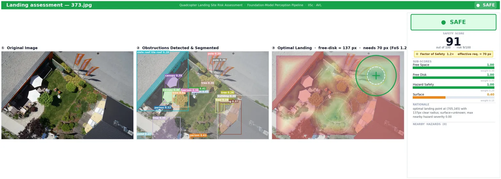
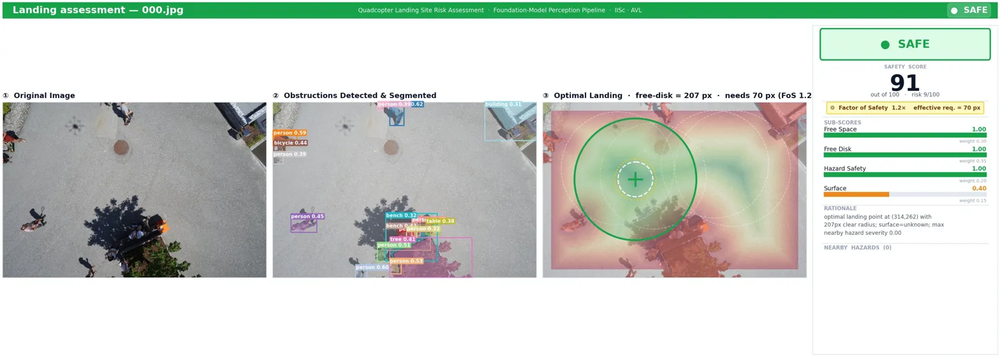
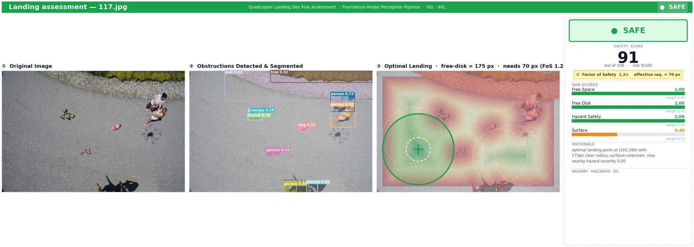
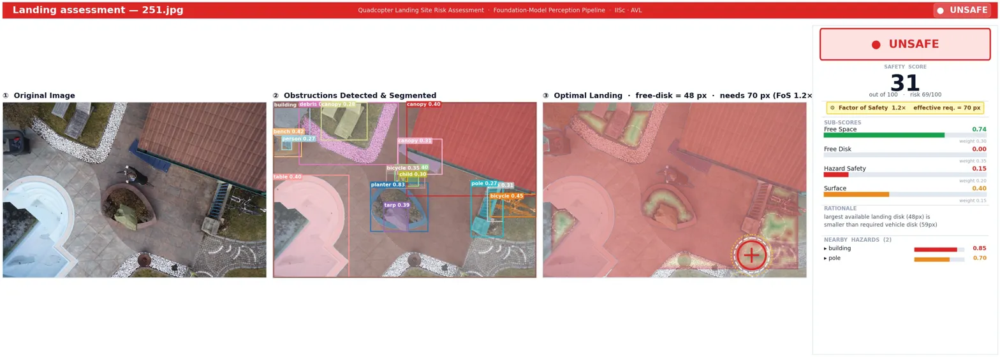

# UAV Landing Site Assessment


A foundation-model perception pipeline that analyses a single downward-facing UAV image and determines **where** a quadcopter can land, **whether** it is safe to land, and **why**.

Unlike conventional landing-site detection approaches that rely on task-specific training or fixed obstacle classes, this pipeline combines foundation models with geometric reasoning to perform **zero-shot landing-site assessment**.

```text
RGB Image
    │
    ▼
Qwen2-VL
(Scene Understanding)
    │
    ▼
Grounding DINO
(Open-Vocabulary Detection)
    │
    ▼
SAM
(Pixel Segmentation)
    │
    ▼
Distance Transform
(Free-space Search)
    │
    ▼
Risk Scoring
    │
    ▼
SAFE / CAUTION / UNSAFE
```

## Table of Contents

- Motivation
- Key Features
- Pipeline Stages
- Requirements
- Installation
- Quick Start
- Repository Structure
- Configuration
- Dataset
- Sample Outputs
- Design Notes
- Future Work
- Limitations
- Citation
- License

## Motivation

Most landing-site detection systems either train a dedicated segmentation model on a predefined obstacle taxonomy or rely on a hard-coded list of hazards. Both approaches struggle when a scene contains previously unseen objects.

This project instead uses a Vision-Language Model (VLM) to reason about the scene in open vocabulary, Grounding DINO to localise the hazards, SAM to obtain pixel-accurate masks, and geometric free-space analysis to determine whether a safe landing zone exists.

## Key Features

- Zero-shot landing-site assessment
- Open-vocabulary obstacle detection
- Pixel-accurate segmentation using SAM
- Geometry-based landing-zone search
- Multi-factor safety score (0–100)
- Human-readable safety rationale
- Robustness evaluation under common image degradations
- Modular Python package and CLI

## Pipeline Stages

| Stage | Model | Purpose |
|------|------|------|
| Scene reasoning | `Qwen/Qwen2-VL-7B-Instruct` | Scene understanding, hazard reasoning and surface classification |
| Detection | `IDEA-Research/grounding-dino-tiny` | Open-vocabulary object detection |
| Segmentation | `facebook/sam-vit-large` | Pixel-accurate obstacle masks |
| Landing search | OpenCV `distanceTransform` | Largest obstacle-free landing region |
| Risk scoring | Weighted scoring | Safety score and recommendation |
| Visualisation | Matplotlib | Four-panel assessment dashboard |

The pipeline produces one of three recommendations: **SAFE**, **CAUTION**, or **UNSAFE**, together with a numerical safety score and a detailed explanation.

## Requirements

- Python 3.10+
- CUDA-capable GPU recommended
- ≥16 GB VRAM recommended for Qwen2-VL-7B FP16
- CPU execution supported (significantly slower)

## Installation

```bash
git clone https://github.com/hariprasanth-paranjothy/uav-landing-assessment.git
cd uav-landing-assessment

python -m venv .venv
source .venv/bin/activate

pip install -r requirements.txt
pip install -e .
```

## Quick Start

```bash
python scripts/run_analysis.py path/to/image.jpg --output-dir results

python scripts/run_analysis.py path/to/image_dir --output-dir results --no-show

python scripts/robustness_eval.py path/to/image.jpg --output-dir results/robustness
```

Or use as a library:

```python
from landing_assessment import Config, LandingAssessmentPipeline

pipeline = LandingAssessmentPipeline(Config())
result = pipeline.analyze("image.jpg", save_dir="results")

print(result["assessment"]["recommendation"])
print(result["assessment"]["safety_score"])
print(result["assessment"]["rationale"])
```

## Repository Structure

```text
uav-landing-assessment/
├── README.md
├── LICENSE
├── pyproject.toml
├── requirements.txt
├── src/
│   └── landing_assessment/
├── scripts/
├── assets/
└── results/
```

## Configuration

Key parameters inside `Config` include:

| Parameter | Description |
|-----------|-------------|
| `box_threshold` | Grounding DINO confidence threshold |
| `text_threshold` | Text confidence threshold |
| `vehicle_radius_frac` | Required landing radius |
| `edge_margin_frac` | Border safety margin |
| `factor_of_safety` | Landing footprint margin |
| `w_freespace` | Free-space weight |
| `w_freedisk` | Landing-disk weight |
| `w_hazard` | Hazard weight |
| `w_surface` | Surface suitability weight |

## Dataset

Experiments use the Semantic Drone Dataset, although the pipeline accepts any downward-facing RGB aerial image.

```bash
kaggle datasets download -d bulentsiyah/semantic-drone-dataset -p data/ --unzip
```

## Sample Outputs

Representative landing-site assessments generated by the pipeline on different aerial scenes.

<p align="center">
  
</p>

<p align="center">
  
</p>

<p align="center">
  
</p>

<p align="center">
  
</p>

Each dashboard displays the original image, open-vocabulary detections, SAM segmentations, free-space geometry, optimal landing location, and the final safety assessment.

## Design Notes

- Open-vocabulary perception instead of fixed object taxonomies.
- Geometry-based landing decisions for interpretability.
- Safety constraints override weighted scores whenever required.
- Automatic detection of repetitive VLM outputs with retry logic.
- Dedicated robustness evaluation script.

## Future Work

- Video-based temporal consistency
- Embedded GPU optimisation
- PX4 / ArduPilot integration
- Multi-view landing assessment
- Terrain slope estimation
- Real-time inference improvements

## Limitations

- Single-image inference only.
- Risk weights are hand-tuned rather than flight calibrated.
- Qwen2-VL dominates runtime and GPU memory usage.

## Citation

```bibtex
@misc{paranjothy2026uavlandingassessment,
  title={UAV Landing Site Assessment},
  author={Hariprasanth Paranjothy},
  year={2026},
  howpublished={\url{https://github.com/hariprasanth-paranjothy/uav-landing-assessment}}
}
```

## License

Released under the MIT License. See `LICENSE` for details.
